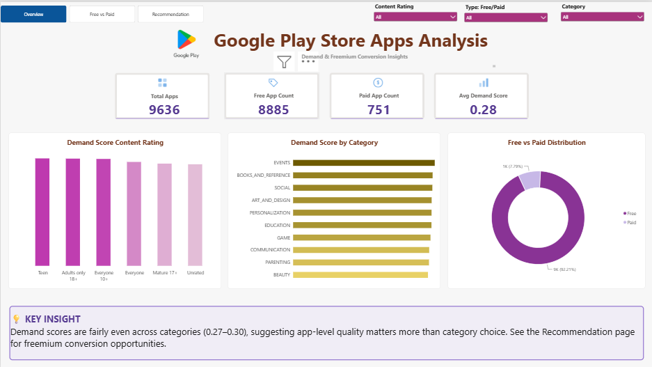
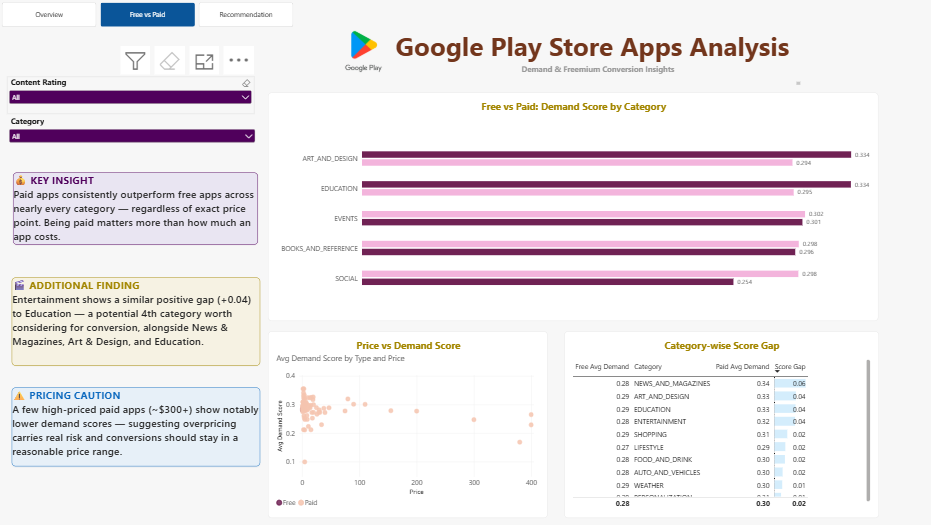
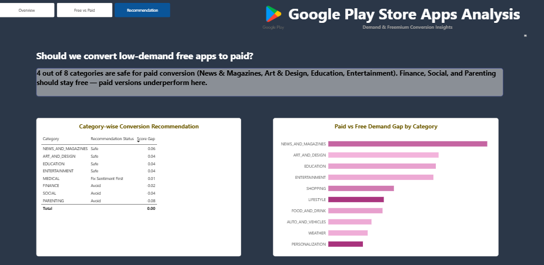

# Google Play Store Apps Analysis: Demand & Freemium Conversion

An end-to-end data analytics project that answers one business question: **should a publisher convert low-demand free apps to paid, and which categories are safe candidates?**


## Result in Brief

**Answer: Conditional Yes, for 4 categories.** Freemium conversion is recommended only for **News & Magazines, Art & Design, Education, and Entertainment**, where existing paid apps already outperform free apps in demand. **Medical** needs sentiment fixes first. **Finance, Social, and Parenting** should stay free. Converting the identified low-demand free apps in the first three categories is estimated at roughly **$16.7M to $50.1M** in additional revenue (5% to 15% retention).

## Business Problem

A publisher owns many free apps and wants to know whether some of them should move to a paid or freemium model. Converting the wrong app can hurt its user base, so the decision needs to be based on evidence rather than guesswork.

This project answers:

1. Which categories have the highest demand?
2. Do paid apps outperform free apps in the same category (Score Gap)?
3. Which categories have no paid apps to compare against?
4. What price range do paid apps use in each category?
5. Which free apps have the lowest demand (the actual conversion candidates)?
6. Does review sentiment explain why some free apps have low demand?
7. How much revenue could conversion generate at different retention rates?

## Dataset

**Source:** [Google Play Store Apps (Kaggle)](https://www.kaggle.com/datasets/lava18/google-play-store-apps), scraped in 2018 (static snapshot).

| File | Description |
|---|---|
| `googleplaystore.csv` | ~10,000 app listings (category, rating, installs, price, etc.) |
| `googleplaystore_user_reviews.csv` | ~64,000 user reviews with sentiment labels |

After cleaning, **9,636 apps** remain in the analysis.

## Tech Stack


- **SQL Server**: data cleaning, Demand Score, analysis queries
- **Power BI**: 3-page interactive dashboard

## Workflow

```
Raw CSVs -> SQL Server cleaning -> Demand Score -> Analysis queries -> Power BI dashboard
```

## Data Cleaning

Raw tables (`apps_raw`, `reviews_raw`) are never modified. Cleaned tables are rebuilt from them on every run.

| Issue | Fix |
|---|---|
| Rating above 5 (malformed rows) | Excluded |
| Duplicate app names | Kept the row with the most reviews |
| Size stored as text (`19M`, `Varies with device`) | Converted to numeric MB, unknowns set to NULL |
| Installs stored as text (`10,000+`) | Cleaned and converted to a number |
| Price stored as text (`$4.99`) | Converted to decimal |
| Reviews with missing sentiment or text | Excluded |

## Demand Score

Demand isn't a single column in the data, so each app gets a custom score:

```
Demand Score = 0.45 x Normalized Installs
             + 0.35 x Normalized Rating
             + 0.20 x Normalized Engagement (Reviews / Installs)
```

- Missing ratings are filled with the category average (not zero).
- **Score Gap** per category = average score of Paid apps minus average score of Free apps.
- **Low demand** = Demand Score below the overall average.

## Dashboard

### Overview
Headline KPIs (total, free and paid apps) and demand levels across categories.



### Free vs Paid
Demand Score comparison of free and paid apps per category, including the Score Gap.



### Recommendation
Category-by-category verdict (Safe / Fix Sentiment First / Avoid) with the Score Gap.



## Key Findings

| Category | Recommendation | Score Gap (Paid - Free) |
|---|---|---|
| News & Magazines | Safe | +0.057 |
| Art & Design | Safe | +0.040 |
| Education | Safe | +0.039 |
| Entertainment | Safe | +0.038 |
| Medical | Fix Sentiment First | +0.0006 |
| Finance | Avoid | -0.022 |
| Social | Avoid | -0.044 |
| Parenting | Avoid | -0.077 |

- **How verdicts were decided:** a positive Score Gap means paid apps already outperform free ones in that category, so conversion is lower risk (Safe). A negative gap means free apps have higher demand, so conversion would likely cost installs (Avoid). A near-zero gap means price isn't the driver, so other issues must be fixed first.
- **Sentiment:** several Medical apps have positive review rates below 30% (e.g., Anthem BC Anywhere at 25.8%). Their low demand looks like a usability and trust problem, not a pricing one.
- **Revenue:** at 10% retention, converting the identified low-demand free apps in News & Magazines ($22.4M), Art & Design ($1.5M), and Education ($9.5M) is estimated at about $33.4M. Across the 5% to 15% range this is about $16.7M to $50.1M. Entertainment was confirmed during the dashboard review and is not included in these figures.
- Full details are in [`docs/insights.md`](docs/insights.md).

## Recommendations

1. Convert the lowest-demand free apps in News & Magazines, Art & Design, Education, and Entertainment.
2. Improve sentiment in Medical before considering conversion there.
3. Keep Finance, Social, and Parenting apps free.

## Assumptions

- Demand Score weights (45/35/20) and scaling limits are analyst choices, not industry standards.
- "Low demand" means a Demand Score below the overall average.
- Retention rates (5%, 10%, 15%) in the revenue estimate are assumptions, not observed data. Retention means the share of a converted app's existing installs that stay after it becomes paid.
- Post-conversion price is assumed to equal the category's current average paid price.
- Sentiment analysis uses only reviews already translated to English in the dataset.

## Limitations

- Installs are given as ranges (e.g., 10,000+), not exact counts.
- A few very large apps skew the installs component of the score.
- Score Gap shows association between free and paid apps, not proof that converting one specific app will succeed.
- Review data covers only ~1,074 unique apps, not all ~10,000.
- Revenue estimate ignores lost ad revenue and possible user drop-off after conversion.
- Some categories have very few paid apps (e.g., only 2 in News & Magazines for price benchmarking).
- 3 categories (Beauty, Comics, House_and_Home) had no paid apps at all, so no Free-vs-Paid comparison was possible for them; they were excluded from the recommendation.
- Data is a 2018 snapshot of Google Play only (no iOS comparison); market conditions may have changed.
- The reverse strategy (Paid to Free for underperforming paid apps) was not tested.

## Repository Structure

```
google-play-store-analysis/
├── data/
│   ├── googleplaystore.csv
│   └── googleplaystore_user_reviews.csv
├── sql/
│   ├── 01_raw_data_checks.sql
│   ├── 02_data_cleaning.sql
│   ├── 03_demand_score.sql
│   ├── 04_demand_analysis.sql
│   └── 05_revenue_estimate.sql
├── powerbi/
│   └── Dashboard.pbix
├── images/
│   ├── playstore.png
│   ├── dashboard_overview.png
│   ├── dashboard_free_vs_paid.png
│   └── dashboard_recommendation.png
├── docs/
│   └── insights.md
├── .gitignore
└── README.md
```

## How to Reproduce

1. Download the CSVs from Kaggle into `data/`.
2. Import them into SQL Server as `apps_raw` and `reviews_raw`.
3. Run the scripts in `sql/` in order, `01` through `05`.
4. Open `powerbi/Dashboard.pbix` in Power BI, point it to your database, and refresh.


